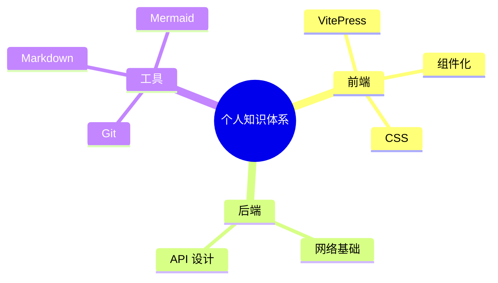
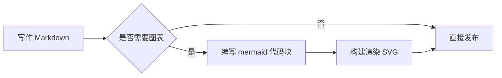
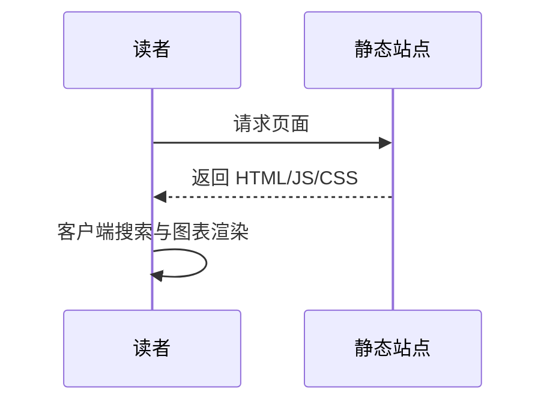

# 用 Mermaid 画脑图与流程图

本站内置 Mermaid 渲染，直接使用 ```` ```mermaid ```` 代码块即可绘制图表。

## 脑图 Mindmap



## 流程图 Flowchart



## 序列图 Sequence



> 提示：Mermaid 支持 `mindmap`、`flowchart`、`sequenceDiagram`、`classDiagram`、`gantt` 等多种图表类型，满足脑图与流程图需求。
