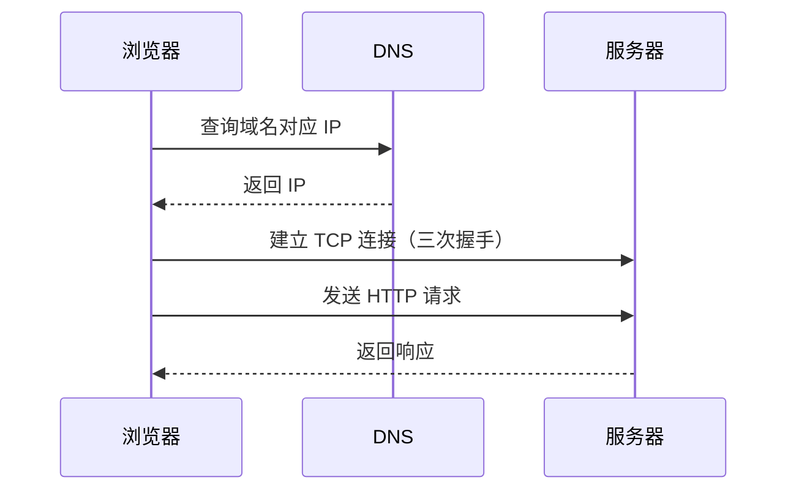

# 网络基础：从请求到响应

## 一次请求的旅程

## 序列图

```mermaid
sequenceDiagram
  participant B as 浏览器
  participant D as DNS
  participant S as 服务器
  B->>D: 查询域名对应 IP
  D-->>B: 返回 IP
  B->>S: 建立 TCP 连接（三次握手）
  B->>S: 发送 HTTP 请求
  S-->>B: 返回响应
```

## 关键概念

- **DNS**：域名 → IP 的解析服务；
- **TCP**：面向连接的可靠传输协议；
- **HTTP**：无状态的应用层协议。

理解这三者的分工，就能看懂「打开一个网页」背后发生的大部分事情。
